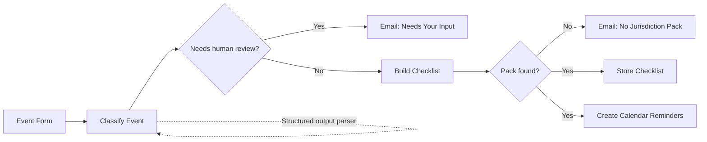
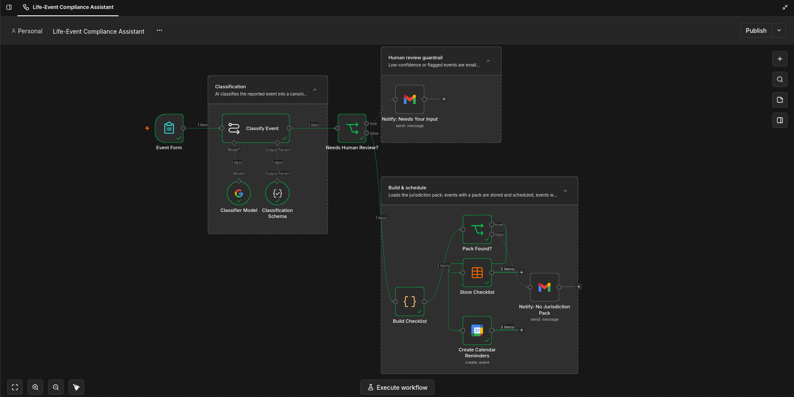
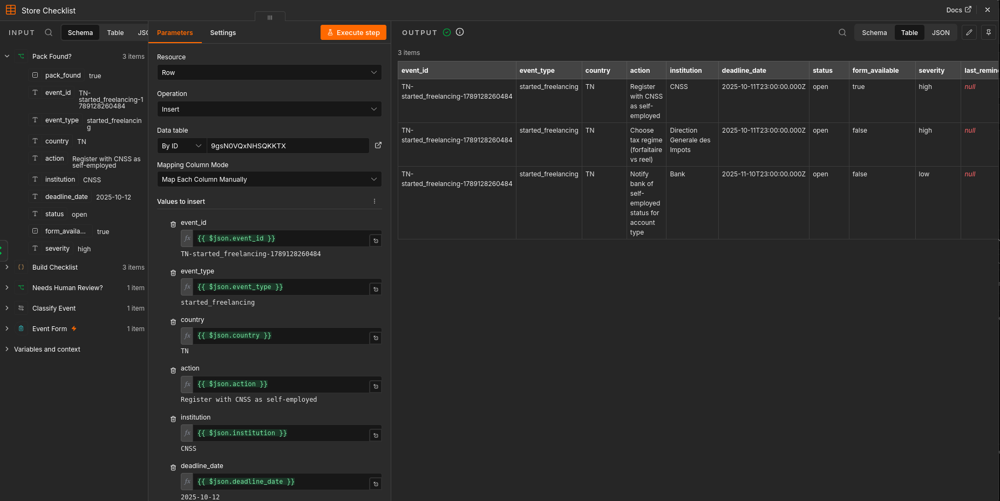
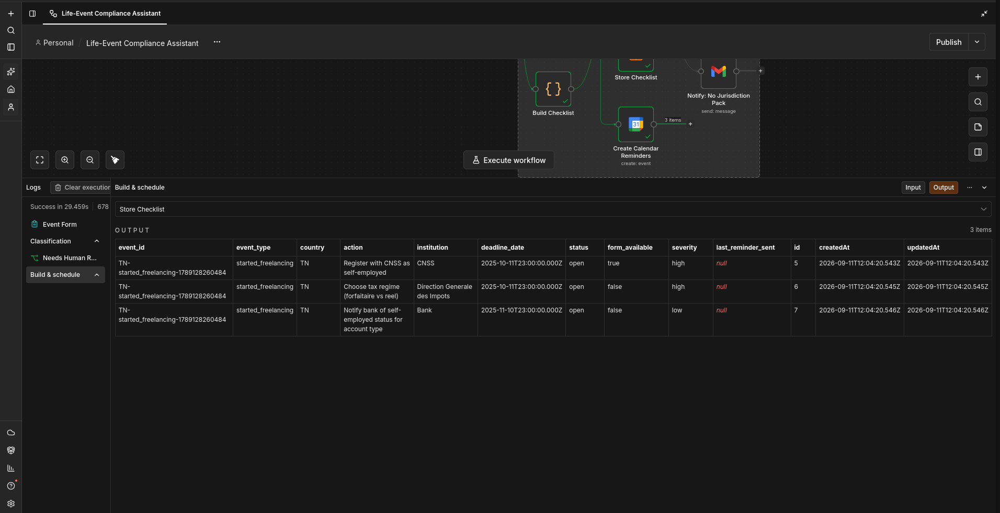
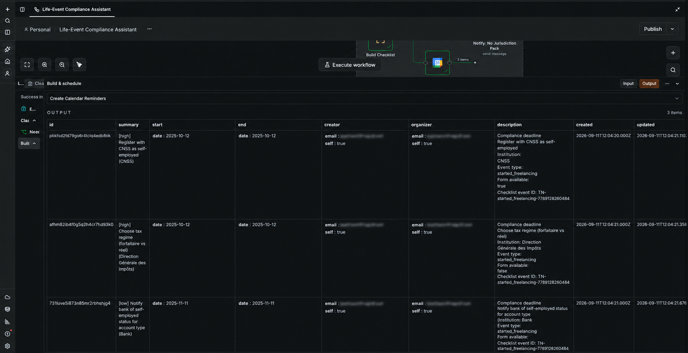
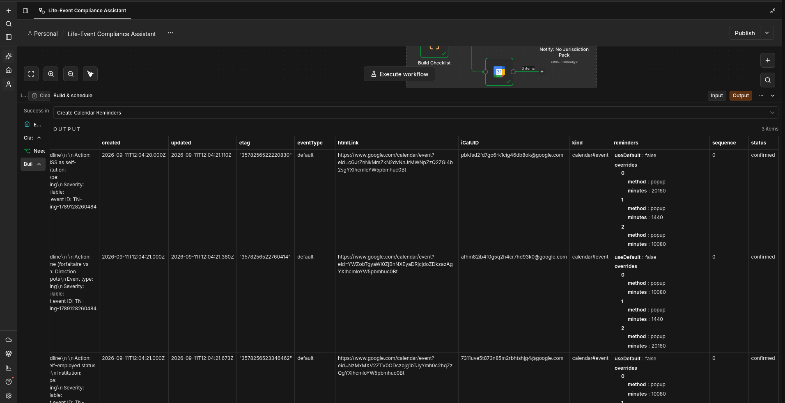

# Life-Event Compliance Assistant

> An n8n workflow that turns a reported life event into a structured compliance checklist, stores the resulting actions, and creates deadline reminders in Google Calendar.

[](https://n8n.io/)
[](https://ai.google.dev/)
[](https://calendar.google.com/)
[](#license)

## Overview

Administrative compliance is often difficult because the triggering event is simple, while the follow-up work is fragmented across institutions, forms, deadlines, email, and personal calendars. A person may know that they started freelancing, moved address, had a child, lost a job, registered a business, experienced a bereavement, or needs to renew a visa, but still not know which organizations must be contacted, which documents are required, or when an action is due.

The **Life-Event Compliance Assistant** provides a structured first layer for that problem. It accepts a life event through an n8n form, uses a Google Gemini model to normalize and classify the submission, applies a jurisdiction-specific checklist pack, records the resulting actions in an n8n Data Table, and creates all-day Google Calendar events for the calculated deadlines.

The workflow is intentionally conservative. Low-confidence classifications and contradictory details are routed to human review instead of being processed automatically. Events without a matching jurisdiction pack are also reported for manual handling rather than silently producing an incomplete checklist.

This repository contains the workflow export and demonstration screenshots. It is not a standalone web application, legal-advice engine, or complete multi-country compliance database.

## Why this system exists

The system is designed to reduce the operational gap between **recognizing a life event** and **completing the administrative actions that follow it**. Its value comes from connecting four activities that are commonly handled separately:

| Problem | How the workflow responds |
| --- | --- |
| Important events are recorded inconsistently. | A guided form captures a canonical event type, event date, and optional context. |
| Free-form descriptions are difficult to route reliably. | An AI classifier produces a structured result with confidence, extracted dates, and entities. |
| Compliance actions vary by jurisdiction and event type. | A swappable jurisdiction-pack object maps an event to actions, institutions, deadlines, severity, and form availability. |
| Deadlines are easy to forget after a checklist is created. | Each generated action becomes an all-day Google Calendar event with advance popup reminders. |
| Automation can be unsafe when information is ambiguous. | Low-confidence or contradictory submissions are sent to a human-review email path. |
| Coverage gaps can be hidden from the user. | Missing jurisdiction packs trigger a dedicated notification and a manual-review outcome. |

The workflow is therefore best understood as a **compliance-intake and deadline-orchestration layer**. It does not replace an official institution, a qualified professional, or the user's own verification of current requirements.

## What the workflow can do

A user submits one of the configured event types through the n8n form. The current dropdown contains `started_freelancing`, `new_child`, `lost_job`, `moved_address`, `business_registered`, `family_member_deceased`, and `visa_renewal`. The form also captures an event date and accepts optional details such as names, reference numbers, or additional context.

The submission is then passed to a structured AI classification step. The classifier returns the canonical event type, a confidence level, any dates it can identify in ISO format, extracted entities such as institutions or reference numbers, and a `needs_human_review` flag. The fixed event type selected in the form is treated as authoritative unless the written details clearly contradict it.

When the result is safe to process, the workflow loads the applicable jurisdiction pack. For the currently implemented `TN:started_freelancing` pack, the workflow generates three actions:

| Action | Institution | Deadline | Form available | Severity |
| --- | --- | ---: | :---: | :---: |
| Register with CNSS as self-employed | CNSS | 30 days after the event | Yes | High |
| Choose the tax regime: forfaitaire or réel | Direction Générale des Impôts | 30 days after the event | No | High |
| Notify the bank of self-employed status for account type | Bank | 60 days after the event | No | Low |

Each action is stored as an individual checklist row. The same action is also created as an all-day Google Calendar event. The event title includes severity, action, and institution, while the description preserves the event type, form availability, and checklist event identifier for traceability.

If the classifier is uncertain or the details are self-contradictory, the workflow sends a human-review email. If the event is classified confidently but no jurisdiction pack exists, the workflow sends a separate coverage-gap notification and does not create an automated checklist or calendar events.

## Architecture

The workflow is organized into three operational stages: intake and classification, guarded checklist generation, and persistence and reminders.



### Workflow components

| Component | n8n node | Responsibility |
| --- | --- | --- |
| Intake | `Event Form` | Captures event type, event date, and optional details through an n8n form trigger. |
| Classification | `Classify Event` | Sends the form data to the language model with instructions for canonical classification and entity/date extraction. |
| Model | `Classifier Model` | Provides the Google Gemini chat model used by the classification chain. |
| Output contract | `Classification Schema` | Constrains the model response to a predictable structured object. |
| Safety gate | `Needs Human Review?` | Routes low-confidence or explicitly flagged submissions to manual review. |
| Human review | `Notify: Needs Your Input` | Sends a Gmail message containing the original submission and classifier result. |
| Rule engine | `Build Checklist` | Resolves the country/event key, calculates deadlines, and emits checklist rows. |
| Coverage gate | `Pack Found?` | Separates supported jurisdiction packs from unsupported events. |
| Persistence | `Store Checklist` | Inserts generated actions into the `Compliance Checklist` n8n Data Table. |
| Reminder creation | `Create Calendar Reminders` | Creates all-day Google Calendar events with compliance metadata and popup reminders. |
| Coverage notification | `Notify: No Jurisdiction Pack` | Alerts the owner when no automated pack is available. |



*The n8n canvas shows the complete control flow, including the human-review guardrail and the separate no-jurisdiction fallback.*

## Screenshots and demonstrated behavior

### Guided event intake and workflow execution

The workflow starts with a form rather than requiring a user to understand the internal n8n graph. A canonical dropdown reduces classification ambiguity, while the optional details field preserves useful context for review and future rule-pack development.



*The Store Checklist node maps generated fields into the n8n Data Table. The output shown contains three actions for a Tunisia self-employment event.*

### Stored compliance checklist

The persistence step stores one row per action. This makes the result queryable and gives each generated action a stable event identifier, deadline, status, severity, and form-availability flag.



*The execution output shows three checklist rows with their institutions, calculated deadlines, status, and severity.*

### Calendar reminders

The workflow creates all-day calendar events for each deadline. The configured popup reminders occur 15 days, 10 days, and 7 days before the deadline, subject to the calendar provider's handling of the event date.



*The first calendar output view shows the generated event summaries and compliance descriptions.*



*The second output view shows confirmed Google Calendar event records and their reminder overrides.*

## Data model

### Classification result

The AI classification step is expected to return an object with the following shape:

```json
{
  "event_type": "started_freelancing",
  "confidence": "high",
  "extracted_dates": ["2026-09-01"],
  "extracted_entities": ["CNSS"],
  "needs_human_review": false
}
```

`event_type` should match one of the canonical values configured in the form. `confidence` is one of `high`, `medium`, or `low`. Dates are represented as ISO `YYYY-MM-DD` strings. `needs_human_review` is reserved for clear contradictions or self-contradictory details, while the workflow independently routes `low` confidence results to review.

### Checklist table

The `Compliance Checklist` Data Table uses the following fields:

| Field | Type | Meaning |
| --- | --- | --- |
| `event_id` | String | Identifier shared by all actions generated from one submitted event. |
| `event_type` | String | Canonical event type used to select the jurisdiction pack. |
| `country` | String | Jurisdiction key. The current implementation uses `TN`. |
| `action` | String | Administrative action to complete. |
| `institution` | String | Organization associated with the action. |
| `deadline_date` | Date/time | Calculated action deadline. |
| `status` | String | Initial value is `open`. |
| `form_available` | Boolean | Indicates whether the pack provides a known form or form path for the action. |
| `severity` | String | Current values are `high`, `medium`, or `low`. |
| `last_reminder_sent` | Date/time | Reserved for future reminder tracking and follow-up automation. |

## Installation and setup

### Prerequisites

You need an n8n instance with permission to import and execute workflows. You also need credentials for Google Gemini, Gmail, and Google Calendar. The workflow uses n8n Data Tables, so the target instance must support Data Tables and allow the workflow to access the configured checklist table.

The exported workflow contains credential references from the author's n8n environment. Credential identifiers are instance-specific and should be replaced or remapped after import. Do not commit API keys, OAuth tokens, or private credential exports to this repository.

### Import the workflow

1. Download or clone this repository.
2. Open your n8n workspace.
3. Import `Life-Event Compliance Assistant.json` from the workflow import menu.
4. Review every credential reference and select credentials belonging to your own n8n instance.
5. Confirm that the form trigger path `life-event` is available and does not conflict with another workflow.
6. Create or select an n8n Data Table named `Compliance Checklist`.
7. Verify that the Store Checklist node maps to the correct Data Table in your instance.
8. Review the Gmail recipient addresses in both notification nodes and replace them with an intended owner or review mailbox.
9. Review the Google Calendar selected by the Create Calendar Reminders node.
10. Activate or publish the workflow only after running a controlled test with a non-production calendar and mailbox.

### Configure the Data Table

Create a Data Table with the fields shown in the data model above. The workflow inserts rows; it does not provide a complete lifecycle for updating an action to `completed`, rescheduling a deadline, or recording a sent reminder. Those capabilities can be added as later workflow stages.

### Configure credentials

The imported nodes require three external integrations:

| Integration | Used by | Purpose |
| --- | --- | --- |
| Google Gemini | Classifier Model | Structured classification and extraction. |
| Gmail | Both notification nodes | Human-review and missing-pack alerts. |
| Google Calendar | Create Calendar Reminders | All-day deadline events and popup reminders. |

Use OAuth or API credentials managed by n8n. Grant only the scopes required by the workflow and use a dedicated mailbox/calendar where possible. The workflow should be tested with data that does not contain unnecessary personal or confidential information.

## Running the workflow

After the workflow is active, open the generated form URL or the configured n8n form endpoint. Select an event type, enter the event date, and add optional details when they improve the context. Submit the form once.

For a supported pack, the expected result is one or more checklist rows and corresponding calendar events. For an ambiguous submission, the expected result is a review email and no automatic checklist creation. For a confidently classified event without a pack, the expected result is a no-jurisdiction notification and no automatic calendar events.

A representative test case for the current implementation is:

| Field | Example |
| --- | --- |
| Event Type | `started_freelancing` |
| Event Date | A valid date for the start of the activity |
| Details | Optional institution names, reference numbers, or explanatory context |

The screenshots in this repository show a successful execution of that path. The dates displayed in the screenshots are execution data from the captured n8n run and are not a statement of current legal deadlines.

## Extending the system

### Add a new jurisdiction or event pack

Jurisdiction logic is concentrated in the `packs` object inside the `Build Checklist` Code node. A new pack can be added using the `COUNTRY:event_type` key format without changing the downstream storage or calendar nodes.

```javascript
const packs = {
  'TN:started_freelancing': [
    {
      action: 'Register with CNSS as self-employed',
      institution: 'CNSS',
      deadline_days_from_event: 30,
      form_available: true,
      severity: 'high'
    }
  ],
  'TN:new_child': [
    {
      action: 'Replace this example with a verified official requirement',
      institution: 'Relevant institution',
      deadline_days_from_event: 30,
      form_available: false,
      severity: 'medium'
    }
  ]
};
```

Before enabling a new pack, verify every action against current official guidance for the relevant jurisdiction. A pack should document its source, effective date, assumptions, and review owner outside the workflow or in a maintained configuration layer. The workflow currently stores the pack's output, but it does not itself provide source citation or legal validation.

### Add a new event type

Add the new canonical value to the Event Form dropdown, update the classifier prompt's canonical set, and create at least one matching jurisdiction-pack key. If the form value and pack key do not match exactly, the workflow will route the event to the no-pack path.

### Improve follow-up management

The current workflow creates open checklist rows and calendar reminders, but it does not provide a user-facing completion interface. A next iteration could add a status-update form, reminder deduplication, overdue notifications, document uploads, official source URLs, and a dashboard that groups actions by event or deadline.

## Safety, privacy, and limitations

This workflow is an automation aid, not legal, tax, immigration, employment, medical, or financial advice. Compliance requirements can change, may depend on facts not captured by the form, and may differ by person, entity type, residency, or institution. Always verify important actions and deadlines with the relevant official institution or a qualified professional.

The AI step can misclassify ambiguous language, extract an incorrect date, or miss a relevant entity. The human-review branch reduces this risk but does not eliminate it. A high-confidence result is not proof that the underlying compliance interpretation is correct.

The current jurisdiction coverage is intentionally narrow. The repository contains an implemented Tunisia (`TN`) pack for `started_freelancing`; the other form options are intake categories, not evidence that complete automated packs exist for them. Unsupported events are explicitly routed to manual review.

The workflow handles personal event information and may send that information to the configured AI and email providers. Configure data retention, access control, credential scopes, and provider settings according to the sensitivity of the data and the requirements of the deployment environment. Use synthetic data while testing.

## Repository layout

```text
.
├── Life-Event Compliance Assistant.json  # n8n workflow export
├── screenshots/
│   ├── workflow.png                      # Full workflow canvas
│   ├── store-checklist-setup.png         # Data Table mapping and sample rows
│   ├── store-checklist.png               # Stored checklist execution output
│   ├── calender-reminder-output1.png     # Calendar event output view
│   └── calender-reminder-output2.png     # Calendar record and reminder output
└── README.md                              # Project documentation
```

## Troubleshooting

| Symptom | Likely cause | Resolution |
| --- | --- | --- |
| The form submits but classification fails. | Gemini credentials are missing, invalid, or not mapped after import. | Reopen the Classifier Model node and select a working Google Gemini credential. |
| Every event reaches human review. | The model output does not match the structured schema or confidence is low. | Inspect the Classify Event output and confirm the schema parser is connected. |
| A supported event reports no jurisdiction pack. | The event type or country key does not exactly match the `packs` object. | Compare the form value with the `COUNTRY:event_type` key in Build Checklist. |
| Checklist rows are not created. | The Data Table reference is instance-specific or unavailable. | Select the correct `Compliance Checklist` Data Table and verify its columns. |
| Calendar events are not created. | Google Calendar credentials, calendar selection, or permissions are invalid. | Reconnect the credential and test with a dedicated calendar. |
| Notifications go to the wrong mailbox. | Imported Gmail nodes retain the original recipient. | Replace the recipient in both notification nodes before activation. |
| Dates appear unexpected. | The workflow calculates deadlines from the submitted event date and the n8n date/time context. | Check the submitted date, timezone, and the deadline offset configured in the pack. |

## Contributing

Contributions should keep the workflow safe, explicit, and reviewable. When adding a jurisdiction pack, include the jurisdiction and event key, the source and effective date of each requirement, the deadline assumptions, and a test execution or screenshot. Avoid embedding secrets or private credentials in workflow exports.

For larger changes, describe the intended behavior, the human-review implications, and how unsupported or contradictory input is handled. Changes that broaden automated compliance coverage should receive subject-matter review before production use.

## License

No license file is currently included in this repository. Until a license is added, treat the workflow and its accompanying assets as **all rights reserved** and request permission before redistributing or incorporating them into another project.

## References

[1]: https://docs.n8n.io/ "n8n Documentation"
[2]: https://docs.n8n.io/integrations/builtin/core-nodes/n8n-nodes-base.formtrigger/ "n8n Form Trigger documentation"
[3]: https://ai.google.dev/gemini-api/docs "Google Gemini API documentation"
[4]: https://developers.google.com/calendar/api/guides/overview "Google Calendar API documentation"
[5]: https://support.google.com/mail/answer/7126229 "Gmail API and authorization guidance"

The implementation details in this README are derived from the workflow export and screenshots stored in this repository. References [1]–[5] provide the relevant platform documentation for the technologies used by the workflow.
